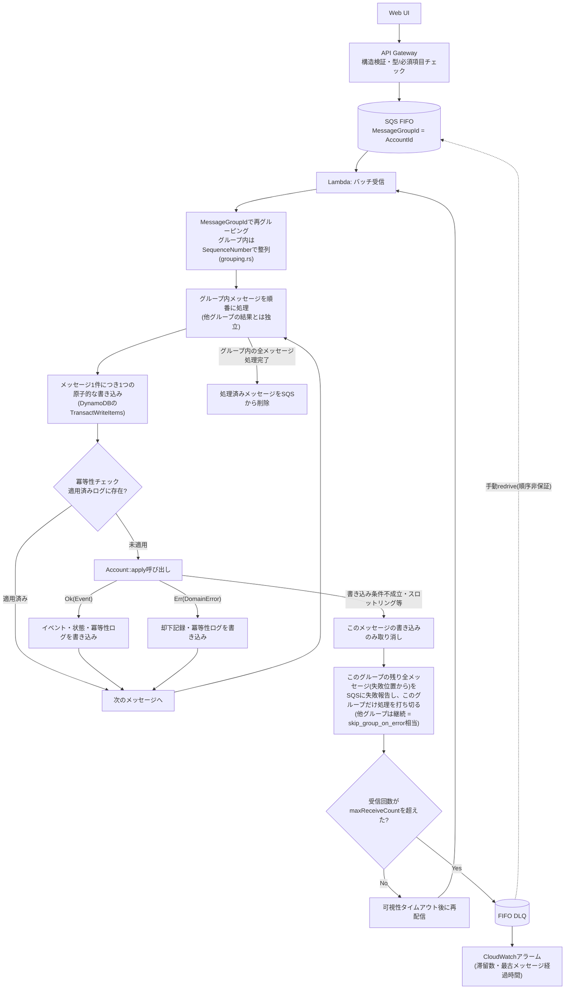

# ADR 0002: SQSメッセージのライフサイクルとエラー分類・DLQ設計

## ステータス

Accepted。`account-service`の実装（`grouping.rs` / `batch.rs` / `handler.rs`）に直接反映する。
永続化層はDynamoDBを前提とする（[[0013-migrate-account-service-off-aurora-dsql]]）。

## コンテキスト

SQS FIFOの`MessageGroupId`にaggregate root ID（口座ID）を設定し、同一集約への操作を
キュー層で直列化する設計を採っている（[[0001-service-boundaries-and-event-driven-integration]]参照）。
Lambdaは1バッチ内のメッセージを`MessageGroupId`で再グルーピングし、グループ内は
メッセージ順に、**1メッセージにつき1つの原子的な書き込み（DynamoDBの`TransactWriteItems`）**
として処理する。

この設計には次の制約が絡む。

- **`TransactWriteItems`は全項目が成功するか全項目が失敗するかの二択で、部分的な確定はできない**。
  複数のSQSメッセージを1回の書き込みにまとめると、そのうち1件でも失敗すれば、それ以前の
  メッセージの成果物も道連れで失敗する。
- **`ConditionExpression`が不成立の場合、DynamoDBは自動的にリトライしない**。楽観的並行性制御
  （OCC）の競合検出後の再試行はアプリケーション層の責務である
  （[AWS公式ドキュメント: Optimistic Locking](https://docs.aws.amazon.com/amazondynamodb/latest/developerguide/bp-optimistic-locking.html)、
  [[0013-migrate-account-service-off-aurora-dsql]]決定2）。
- **FIFOキューでは、あるメッセージグループの処理が失敗し続けると、Lambdaは同グループの
  後続メッセージを受け取れなくなる**（ヘッドオブラインブロッキング）。

素朴な実装（失敗した位置以降のメッセージだけをSQSに失敗報告する）は、複数メッセージを1つの
書き込みにまとめる設計と組み合わせると**サイレントなデータロスを引き起こす**。以下の決定は
これを避けるための設計である。

## メッセージのライフサイクル



## 決定

### 1. エラーを2種類に分類する

- **`DomainError`（残高不足・凍結中・解約済みなど）**：`Account::apply`は
  `(現在の状態, コマンド)`だけで結果が決まる純粋関数であり、同一`MessageGroupId`内は
  厳密に直列処理されるため、このメッセージを再試行している間に他のメッセージが割り込んで
  状態を変えることはない。したがって`DomainError`は**再試行しても永久に変わらない、
  決定論的に確定した失敗**である。
- **インフラ起因の失敗（DynamoDBの書き込み条件不成立、スロットリング、接続断など）**：これは
  再試行すれば解消しうる、真の一時的失敗である。

`DomainError`はそのメッセージ自身の書き込みで却下記録を記録し、次のメッセージへ進む
（決定2の通り、次のメッセージは別の新しい書き込み）。**SQSには失敗として報告しない**（再試行
させない）。SQSの再試行・DLQの対象は、インフラ起因の失敗だけに絞る。

却下記録自体の書き込みが失敗した場合は、これは新しい問題ではなく、単純に「インフラ起因の
失敗」に分類される。次回再試行時に`Account::apply`が再実行されれば同じ`DomainError`が
決定論的に得られるため、却下確定ロジック自体は自然に冪等である。

### 2. 1メッセージ=1つの原子的な書き込みとする

1つのSQSメッセージは1つの独立した顧客操作であり、複数メッセージを不可分の単位として扱うべき
業務要件はない。各メッセージは「冪等性チェック → `Account::apply` → 結果（イベントor却下記録）の
永続化 → 冪等性ログへの記録」を、DynamoDBの`TransactWriteItems`による1回の原子的な書き込みと
して処理する。

- `DomainError`による却下は、そのメッセージ自身の書き込みで確定する。他のメッセージの成果物を
  巻き戻す必要はない。
- インフラ起因の失敗は、そのメッセージ自身の書き込みだけを取り消せばよく、同一グループ内で
  既に処理済み（個別に書き込み済み）の前段メッセージには一切影響しない。
- `batch.rs`の`failed_message_ids_from(messages, failed_from)`（失敗位置以降だけを報告する）は
  この設計のもとで正しく機能する。前段のメッセージは既に個別の書き込みで永続化済みであり、
  「成功した」とSQSに報告してもデータロスにはならない。

`MessageGroupId`による直列化（同一グループは1つずつ順番に処理する）というFIFOの性質は
この書き込み粒度とは独立であり、失われない。

**却下した代替案: 複数メッセージを1回の`TransactWriteItems`にまとめる（1グループ=1
トランザクション）。** `TransactWriteItems`は全項目が成功するか失敗するかの二択であり、
部分的な確定ができない。グループ内の1メッセージが失敗すれば、それより前のメッセージの
成果物もまとめて失敗扱いになってしまう。1つのSQSメッセージは1つの独立した顧客操作であり、
複数メッセージを不可分の単位として扱うべき業務要件がないため不採用とする。

### 3. 失敗時の停止範囲はグループ単位（バッチ全体ではない）

AWSは`batchItemFailures`の内容を検証しない（歯抜けのメッセージID配列を返しても技術的には
受理される）が、FIFOキューについては次のように明記している。

> If you use a First-In-First-Out (FIFO) queue, your function should stop processing
> messages after the first failure and return all failed and unprocessed messages in
> `batchItemFailures`. This helps preserve the message order of your queue.
> — [AWS Prescriptive Guidance: Best practices for implementing partial batch responses](https://docs.aws.amazon.com/prescriptive-guidance/latest/lambda-event-filtering-partial-batch-responses-for-sqs/best-practices-partial-batch-responses.html)

この文言だけでは「最初の失敗以降」が**バッチ全体**を指すのか、**同じグループだけ**を指すのか
判別できない。AWS公式のPowertools for AWS Lambda（`SqsFifoPartialProcessor`）の実装で
確認したところ、デフォルトは**バッチ全体を停止**する。

> By default, we will stop processing at the first failure and mark unprocessed messages
> as failed to preserve ordering.

グループ単位に区別して他のグループの処理を続けるには、`skip_group_on_error`という
明示的なオプトイン設定が必要になる。つまりAWSの安全側デフォルトは「グループを問わず
最初の失敗以降を全部失敗にする」であり、グループ単位での区別は積極的に選択する必要がある
高度な挙動である。

一方、SQSの`SendMessage` APIリファレンスは「異なるメッセージグループ間の順序は保証されない
（out of orderで処理されうる）」と明言しており、グループ単位で区別すること自体はFIFOの
契約に違反しない。

**決定：本設計では`skip_group_on_error`相当（グループ単位で区別）を採用する。**

根拠：SQSに再試行される失敗は決定1の分類によりインフラ起因の失敗（DynamoDBの書き込み条件
不成立・スロットリング・接続断）に絞られている。条件不成立は項目単位の競合であり、他の口座
（他のグループ）には影響しない。DynamoDB自体が完全に断してしまう systemic な障害であれば、
グループ単位で区別しても結局全グループが失敗するため、区別する/しないで差は出ない。
したがって、グループ単位で区別することのダウンサイドは小さく、無関係な口座の処理を
巻き込まないメリットの方が大きい。

なお、グループ内の残りメッセージ（失敗位置から末尾まで）を歯抜けなく全て失敗報告する
という規律自体は維持する。歯抜けで報告した場合（例：グループ内3番目のメッセージだけ失敗
報告し、4番目以降を報告しない）、4番目はSQSから自動削除されるが、FIFOの順序保証上
3番目が未解決なのに4番目が処理済み・確定として消えることになり、サイレントなデータロスを
引き起こす。AWSはこれを検知・防止してくれないため、アプリケーション側で必ず守る必要がある。

### 4. 冪等性キーはグルーピング方式と独立に必要

SQSは at-least-once 配信であり、バッチをまたいだ重複配信は排除されない。メッセージIDに対する
適用済みログ（ユニーク制約）を持ち、各メッセージの処理の先頭で冪等性チェックを行う。

### 5. グループ内の順序は`SequenceNumber`で明示的に保証する

グループ分けそのものは、1つの書き込みに束ねるためではなく、次の2つの理由で引き続き必要である。

1. **順序の裏付け**：後述の通り、受信順序をそのまま信頼してよいという保証を確認できていない。
2. **決定3の失敗スコープの実現**：グループ単位で処理を打ち切る（他のグループは継続する）には、
   どのメッセージがどのグループに属するかをあらかじめ把握しておく必要がある。バケツに
   分ける現在の実装（`grouping.rs`）は、あるグループの内側ループを打ち切るだけで済み、
   「失敗済みグループの集合」のような追加の状態管理なしにこの failure スコープを実現できる。

順序の裏付けについては、SQSの`SendMessage` APIリファレンス（`MessageGroupId`パラメータの説明）には次の記載がある。

> `ReceiveMessage` might return messages with multiple `MessageGroupId` values. For each
> `MessageGroupId`, the messages are sorted by time sent.

つまり`ReceiveMessage`の応答は`MessageGroupId`ごとに送信時刻順である、とSQS自体は保証している。
ただし、これはSQSの`ReceiveMessage`の保証であり、Lambdaのイベントソースマッピングがこれを
内部でどうバッチ化し`Records`配列を組み立てるかという一段階については、公式に明文化された
保証を見つけられなかった。

金融ドメインのPoCとしてこの未文書化の一段階に依存しないよう、グルーピング後に各グループ内を
`SequenceNumber`属性で明示的にソートする（`grouping.rs`）。`SequenceNumber`は128ビットで、
`MessageGroupId`ごとに単調増加することが同APIリファレンスで保証されている
（Rust実装ではu64の範囲を超えるため`u128`でパースする必要がある）。

### 6. DLQ設計と2段階のリトライ

書き込み条件不成立（インフラ起因の失敗のうち最も頻度が高いもの）は、SQSに戻す前に**Lambda
呼び出し内で即座にリトライする**べきである。DynamoDBは`ConditionExpression`不成立時の自動
リトライを行わないため（[AWS公式ドキュメント](https://docs.aws.amazon.com/amazondynamodb/latest/developerguide/bp-optimistic-locking.html)、
[[0013-migrate-account-service-off-aurora-dsql]]決定2）、最大3回・指数バックオフ+ジッターの
リトライループを自前で実装する。

```rust
let config = OccRetryConfig { max_attempts: 3, ..Default::default() }; // 指数バックオフ+ジッター

retry_on_occ(&config, || async {
    // 冪等性チェック・Account::apply・結果の永続化・冪等性ログ記録を
    // 1回のTransactWriteItemsとして実行し、ConditionalCheckFailedExceptionのみ
    // リトライ対象とする
}).await?;
```

このため、リトライは以下の2段階になる。

1. **Lambda呼び出し内でのリトライ（速い）**：最大3回、指数バックオフ+ジッターで即座に
   リトライする。ミリ秒〜数百ミリ秒で解消する短命な競合は、SQSに一切戻らずここで吸収される。
2. **SQSレベルのリトライ（遅い）**：1の3回を使い切ってなお失敗した場合にのみ
   `batchItemFailures`としてSQSに報告する。以降は`maxReceiveCount`（下記）が効き、
   それも尽きたらDLQへ。

DLQ自体の設計は以下の通り。

- FIFOソースキューのDLQは**FIFOキューでなければならない**（AWSの制約）。
- `maxReceiveCount`は低め（2〜3程度）に設定する。上記の2段階リトライにより、DLQに到達する
  対象は「Lambda内での3回リトライを使い切ってもなお解決しなかった、真に持続的なインフラ起因の
  失敗」だけに絞られているため、長く待つ必要がない。
- Lambdaのイベントソースマッピングで`FunctionResponseTypes: ReportBatchItemFailures`を
  有効化することが前提条件。これがないと、部分バッチ応答（`SqsBatchResponse`）を返しても
  意味を持たず、1メッセージの失敗でバッチ全体がブロックされうる。
- DLQからのリドライブ（redrive-to-source）は**順序を維持しない**（キューの末尾に再投入される）。
  同時に到着する新規メッセージと混在しうるため、同一`MessageGroupId`に対する手動リドライブは、
  古いコマンドが新しい状態の上に後乗りで適用されるリスクを運用者が認識した上で行う必要がある。
- DLQの`ApproximateNumberOfMessagesVisible`と`ApproximateAgeOfOldestMessage`にCloudWatchアラームを張る。

### 7. 却下はEventBridgeへの発行経路を既に持つ（ADR-0004のアウトボックス経由）

`DomainError`による却下は、[[0004-query-service-event-driven-projection]]で実装したアウトボックスが
`kind`属性（`event`/`rejection`）を区別せず一律に処理するため、既に`account.rejection.*`として
EventBridgeへ発行されている。Query Serviceの購読ルールが`account.event.*`のみにマッチする
よう絞っている（`account-pipeline-stack.ts`）ため、現時点では誰も購読していないだけである。
したがって、[[0001-service-boundaries-and-event-driven-integration]]が構想するNotification/Transfer
サービスとの連携は、account-service側の変更なしに、購読側が`account.rejection.*`向けの
EventBridge Ruleを追加するだけで実現できる。

## 却下した代替案

- **区別せず一律`maxReceiveCount`で処理**：`DomainError`も無駄に再試行され、
  ヘッドオブラインブロッキングを自ら誘発するため不採用。
- **`maxReceiveCount`を極端に低くして運用でカバー**：エラー種別を区別しないという本質的な問題は
  解決せず、DLQが却下メッセージで埋まりシグナル/ノイズ比が悪化するため、区別しない方式の中でも
  最も推奨しない。
- **複数メッセージを1回の`TransactWriteItems`にまとめる（1グループ=1トランザクション）**：
  決定2の理由により不採用。
- **失敗時にバッチ全体を停止（Powertoolsのデフォルト挙動）**：安全側のデフォルトとしては
  妥当だが、本設計の失敗経路は書き込み条件不成立等の項目単位のインフラ失敗に絞られており、
  無関係な口座の処理まで止める理由がないため、グループ単位で区別する（`skip_group_on_error`相当）
  方を採用した。
