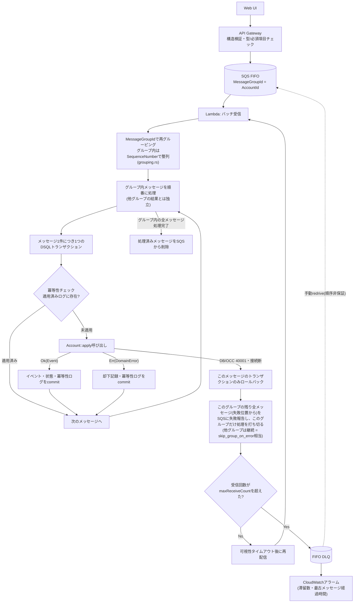

# ADR 0002: SQSメッセージのライフサイクルとエラー分類・DLQ設計

## ステータス

Accepted。`account-service`の実装（`grouping.rs` / `batch.rs` / `handler.rs`）に直接反映する。

## コンテキスト

SQS FIFOの`MessageGroupId`にaggregate root ID（口座ID）を設定し、同一集約への操作を
キュー層で直列化する設計を採っている（[[0001-service-boundaries-and-event-driven-integration]]参照）。
Lambdaは1バッチ内のメッセージを`MessageGroupId`で再グルーピングし、グループ内は
メッセージ順に、**1メッセージにつき1つのDSQLトランザクション**として処理する
（当初検討した「1グループ=1トランザクション」から変更した経緯は決定2を参照）。

この設計には次の制約が絡む。

- **Aurora DSQLはSAVEPOINTを非サポート**（ストアドプロシージャ・トリガーも非サポート）。
  トランザクション内での部分的なロールバックができない。
  ※`SELECT FOR UPDATE`は当初「非サポート」としていたが、公式ドキュメント確認の結果、
  全主キー列への等価述語・単一テーブルという制約付きでサポートされていることが判明した
  （[Supported SQL for Aurora DSQL](https://docs.aws.amazon.com/aurora-dsql/latest/userguide/working-with-postgresql-compatibility-supported-sql-features.html)）。
  ただしSAVEPOINT非サポートという結論自体には影響しない。
- **DSQLのOCC（楽観的並行性制御）競合は主にSQLSTATE `OC000`(データ競合)/`OC001`(スキーマ競合)、
  またはそのフォールバックとして`40001`で失敗し、リトライが必要**
  （[AWS公式Rustコネクタ `aurora-dsql-sqlx-connector`](https://docs.aws.amazon.com/aurora-dsql/latest/userguide/SECTION_program-with-dsql-connector-for-rust-sqlx.html)
  のソースで確認。デフォルトで最大3回・指数バックオフ+ジッターの自動リトライを提供する）。
- **FIFOキューでは、あるメッセージグループの処理が失敗し続けると、Lambdaは同グループの
  後続メッセージを受け取れなくなる**（ヘッドオブラインブロッキング）。

素朴な実装（失敗した位置以降のメッセージだけをSQSに失敗報告する）は、この制約下では
**サイレントなデータロスを引き起こす**ことが設計検討中に判明した。以下、その経緯と決定事項を記録する。

## メッセージのライフサイクル



## 決定

### 1. エラーを2種類に分類する

- **`DomainError`（残高不足・凍結中・解約済みなど）**：`Account::apply`は
  `(現在の状態, コマンド)`だけで結果が決まる純粋関数であり、同一`MessageGroupId`内は
  厳密に直列処理されるため、このメッセージを再試行している間に他のメッセージが割り込んで
  状態を変えることはない。したがって`DomainError`は**再試行しても永久に変わらない、
  決定論的に確定した失敗**である。
- **インフラ起因の失敗（DSQLのOCC競合 `40001`、接続断など）**：これは再試行すれば
  解消しうる、真の一時的失敗である。

`DomainError`はそのメッセージ自身のトランザクション内で却下記録をINSERTしてcommitし、
次のメッセージへ進む（決定2の通り、次のメッセージは別の新しいトランザクション）。
**SQSには失敗として報告しない**（再試行させない）。SQSの再試行・DLQの対象は、インフラ起因の
失敗だけに絞る。

却下記録自体のDB書き込みが失敗した場合は、これは新しい問題ではなく、単純に
「インフラ起因の失敗」に分類される。次回再試行時に`Account::apply`が再実行されれば
同じ`DomainError`が決定論的に得られるため、却下確定ロジック自体は自然に冪等である。

### 2. 1メッセージ=1トランザクション（グループ単位の一括トランザクションから変更）

当初は「グループ内の複数メッセージを1つのDSQLトランザクションにまとめる」設計だった。
しかしDSQLはSAVEPOINTを持たないため、グループ内のどこか1件でもインフラ起因の失敗が起きれば
**そのトランザクション全体がロールバックされ、それより前に処理していたメッセージの効果も
全て消える**という問題が判明した。当初の実装（`batch.rs`の
`failed_message_ids_from(messages, failed_from)`）は「`failed_from`より前のメッセージは
成功した」という前提でSQSに報告していたが、これはロールバックで消えたはずの前段メッセージを
「成功した」とSQSに伝えてキューから削除させる**サイレントなデータロス**を引き起こす欠陥だった。

この問題への対処として、いったんは「グループ処理の結果を成功/失敗の二値にし、失敗時は
グループ全体をindex 0から再試行する」という修正を検討したが、再検討の結果、
**そもそもグループ内の複数メッセージを1つのトランザクションにまとめる必然性がない**
という結論に至った。1つのSQSメッセージは1つの独立した顧客操作であり、複数メッセージを
不可分の1トランザクションとして扱うべき業務要件はどこにもない。

**最終決定：1メッセージにつき1つのDSQLトランザクションとする。**

- 各メッセージは「冪等性チェック → `Account::apply` → 結果（イベントor却下記録）の永続化 →
  冪等性ログへの記録」を1つの原子的なトランザクションとして処理する。
- `DomainError`による却下は、そのメッセージ自身のトランザクションでcommitされる。他の
  メッセージの成果物を巻き戻す必要が最初からないため、SAVEPOINTは不要になった。
- インフラ起因の失敗は、そのメッセージ自身のトランザクションだけをロールバックすればよく、
  同一グループ内で既に処理済み（個別にcommit済み）の前段メッセージには一切影響しない。
- 当初実装していた`batch.rs`の`failed_message_ids_from(messages, failed_from)`
  （失敗位置以降だけを報告する）は、この設計のもとでは**そのまま正しく機能する**。前段の
  メッセージは既に個別のトランザクションで永続化済みであり、「成功した」とSQSに報告しても
  データロスにはならない。

`MessageGroupId`による直列化（同一グループは1つずつ順番に処理する）というFIFOの性質は
トランザクション粒度とは独立であり、この変更によって失われない。トレードオフとして、
DSQLへの往復回数は1グループ1トランザクションの案より増えるが、FIFOの1バッチあたりの
取得上限を踏まえれば許容範囲と判断した。

### 3. 失敗時の停止範囲はグループ単位（バッチ全体ではない）

AWSは`batchItemFailures`の内容を検証しない（歯抜けのメッセージID配列を返しても技術的には
受理される）が、FIFOキューについては次のように明記している。

> If you use a First-In-First-Out (FIFO) queue, your function should stop processing
> messages after the first failure and return all failed and unprocessed messages in
> `batchItemFailures`. This helps preserve the message order of your queue.
> — [AWS Prescriptive Guidance: Best practices for implementing partial batch responses](https://docs.aws.amazon.com/prescriptive-guidance/latest/lambda-event-filtering-partial-batch-responses-for-sqs/best-practices-partial-batch-responses.html)

この文言だけでは「最初の失敗以降」が**バッチ全体**を指すのか、**同じグループだけ**を指すのか
判別できない。AWS公式のPowertools for AWS Lambda（`SqsFifoPartialProcessor`）の実装で
確認したところ、デフォルトは**バッチ全体を停止**する。

> By default, we will stop processing at the first failure and mark unprocessed messages
> as failed to preserve ordering.

グループ単位に区別して他のグループの処理を続けるには、`skip_group_on_error`という
明示的なオプトイン設定が必要になる。つまりAWSの安全側デフォルトは「グループを問わず
最初の失敗以降を全部失敗にする」であり、グループ単位での区別は積極的に選択する必要がある
高度な挙動である。

一方、SQSの`SendMessage` APIリファレンスは「異なるメッセージグループ間の順序は保証されない
（out of orderで処理されうる）」と明言しており、グループ単位で区別すること自体はFIFOの
契約に違反しない。

**決定：本設計では`skip_group_on_error`相当（グループ単位で区別）を採用する。**

根拠：SQSに再試行される失敗は決定1の分類によりインフラ起因の失敗（DSQLのOCC競合`40001`・
接続断）に絞られている。OCC競合は行単位の競合であり、他の口座（他のグループ）には
影響しない。DSQL自体が完全に断してしまう systemic な障害であれば、グループ単位で区別しても
結局全グループが失敗するため、区別する/しないで差は出ない。したがって、グループ単位で
区別することのダウンサイドは小さく、無関係な口座の処理を巻き込まないメリットの方が大きい。

なお、グループ内の残りメッセージ（失敗位置から末尾まで）を歯抜けなく全て失敗報告する
という規律自体は維持する。歯抜けで報告した場合（例：グループ内3番目のメッセージだけ失敗
報告し、4番目以降を報告しない）、4番目はSQSから自動削除されるが、FIFOの順序保証上
3番目が未解決なのに4番目が処理済み・確定として消えることになり、サイレントなデータロスを
引き起こす。AWSはこれを検知・防止してくれないため、アプリケーション側で必ず守る必要がある。

### 4. 冪等性キーはグルーピング方式と独立に必要

SQSは at-least-once 配信であり、バッチをまたいだ重複配信は排除されない。メッセージIDに対する
適用済みログ（ユニーク制約）を持ち、各メッセージの処理の先頭で冪等性チェックを行う。

### 5. グループ内の順序は`SequenceNumber`で明示的に保証する

グループ分けそのものは、1トランザクションに束ねるためではなく、次の2つの理由で
引き続き必要である。

1. **順序の裏付け**：後述の通り、受信順序をそのまま信頼してよいという保証を確認できていない。
2. **決定3の失敗スコープの実現**：グループ単位で処理を打ち切る（他のグループは継続する）には、
   どのメッセージがどのグループに属するかをあらかじめ把握しておく必要がある。バケツに
   分ける現在の実装（`grouping.rs`）は、あるグループの内側ループを打ち切るだけで済み、
   「失敗済みグループの集合」のような追加の状態管理なしにこの failure スコープを実現できる。

順序の裏付けについては、SQSの`SendMessage` APIリファレンス（`MessageGroupId`パラメータの説明）には次の記載がある。

> `ReceiveMessage` might return messages with multiple `MessageGroupId` values. For each
> `MessageGroupId`, the messages are sorted by time sent.

つまり`ReceiveMessage`の応答は`MessageGroupId`ごとに送信時刻順である、とSQS自体は保証している。
ただし、これはSQSの`ReceiveMessage`の保証であり、Lambdaのイベントソースマッピングがこれを
内部でどうバッチ化し`Records`配列を組み立てるかという一段階については、公式に明文化された
保証を見つけられなかった。

金融ドメインのPoCとしてこの未文書化の一段階に依存しないよう、グルーピング後に各グループ内を
`SequenceNumber`属性で明示的にソートする（`grouping.rs`）。`SequenceNumber`は128ビットで、
`MessageGroupId`ごとに単調増加することが同APIリファレンスで保証されている
（Rust実装ではu64の範囲を超えるため`u128`でパースする必要がある）。

### 6. DLQ設計と2段階のリトライ

OCC競合（インフラ起因の失敗のうち最も頻度が高いもの）は、SQSに戻す前に**Lambda呼び出し内で
即座にリトライする**べきである。AWS公式のRust向けDSQLコネクタ`aurora-dsql-sqlx-connector`
（`occ`機能フラグ）が、まさにこのための`retry_on_occ`ヘルパーを提供している。

```rust
use aurora_dsql_sqlx_connector::{retry_on_occ, OCCRetryConfig};

let config = OCCRetryConfig::default(); // max_attempts: 3, exponential backoff + jitter

retry_on_occ(&config, || async {
    let mut tx = pool.begin().await?;
    // 冪等性チェック・Account::apply・結果の永続化・冪等性ログ記録
    tx.commit().await?;
    Ok(())
}).await?;
```

デフォルトは3回まで、指数バックオフ+ジッター付きで自動リトライする。クロージャの中身は
DB操作のみ（副作用なし）にする必要があるという制約があるが、我々の1メッセージ1トランザクション
の処理内容（冪等性チェック→`Account::apply`→結果永続化→冪等性ログ記録）はこの条件を満たす。

このため、リトライは以下の2段階になる。

1. **Lambda呼び出し内でのリトライ（速い）**：`retry_on_occ`により最大3回、指数バックオフ+
   ジッターで即座にリトライする。ミリ秒〜数百ミリ秒で解消する短命なOCC競合は、SQSに
   一切戻らずここで吸収される。
2. **SQSレベルのリトライ（遅い）**：1の3回を使い切ってなお失敗した場合にのみ
   `batchItemFailures`としてSQSに報告する。以降は`maxReceiveCount`（下記）が効き、
   それも尽きたらDLQへ。

なお、当初の設計メモにあった「`sqlx::Error`→`PgDatabaseError`→`.code()`が`"40001"`かを
自前で判定する」という方針は、このコネクタが提供する`is_occ_error`ヘルパーに置き換える。

DLQ自体の設計は以下の通り。

- FIFOソースキューのDLQは**FIFOキューでなければならない**（AWSの制約）。
- `maxReceiveCount`は低め（2〜3程度）に設定する。上記の2段階リトライにより、DLQに到達する
  対象は「Lambda内での3回リトライを使い切ってもなお解決しなかった、真に持続的なインフラ起因の
  失敗」だけに絞られているため、長く待つ必要がない。
- Lambdaのイベントソースマッピングで`FunctionResponseTypes: ReportBatchItemFailures`を
  有効化することが前提条件。これがないと、部分バッチ応答（`SqsBatchResponse`）を返しても
  意味を持たず、1メッセージの失敗でバッチ全体がブロックされうる。
- DLQからのリドライブ（redrive-to-source）は**順序を維持しない**（キューの末尾に再投入される）。
  同時に到着する新規メッセージと混在しうるため、同一`MessageGroupId`に対する手動リドライブは、
  古いコマンドが新しい状態の上に後乗りで適用されるリスクを運用者が認識した上で行う必要がある。
- DLQの`ApproximateNumberOfMessagesVisible`と`ApproximateAgeOfOldestMessage`にCloudWatchアラームを張る。

### 7. 将来のNotificationサービス連携への接続点

`DomainError`による却下を顧客に通知する経路（[[0001-service-boundaries-and-event-driven-integration]]の
イベントバス経由でのNotificationサービス連携）は、本PoCのスコープ外。ただし、却下確定ロジックを
小さな関数/トレイト（例：`RejectionSink`）の背後に置き、今はDB書き込みのみを行う実装とし、
将来EventBridge発行に差し替え可能な形にしておく。これにより、Notificationサービス実装時に
却下確定ロジック自体を書き直す必要がなくなる。

## 却下した代替案

- **区別せず一律`maxReceiveCount`で処理**：`DomainError`も無駄に再試行され、
  ヘッドオブラインブロッキングを自ら誘発するため不採用。
- **`maxReceiveCount`を極端に低くして運用でカバー**：エラー種別を区別しないという本質的な問題は
  解決せず、DLQが却下メッセージで埋まりシグナル/ノイズ比が悪化するため、区別しない方式の中でも
  最も推奨しない。
- **セーブポイントでグループ内の部分ロールバック**：DSQLがSAVEPOINT非サポートのため前提が
  成立しない。加えて、1メッセージ=1トランザクションに変更したことで、そもそも出番がない。
- **1グループ=1トランザクション（当初案）**：DSQLのSAVEPOINT非対応と組み合わさると、
  グループ内の1メッセージのインフラ失敗が同一グループの他メッセージの成果物まで
  巻き戻すため、複数メッセージにまたがる不要な結合が生まれる。1つのSQSメッセージは
  1つの独立した顧客操作であり、複数メッセージを不可分の1トランザクションとして扱うべき
  業務要件がないため、1メッセージ=1トランザクションに変更した。
- **失敗時にバッチ全体を停止（Powertoolsのデフォルト挙動）**：安全側のデフォルトとしては
  妥当だが、本設計の失敗経路はOCC競合等の行単位のインフラ失敗に絞られており、無関係な
  口座の処理まで止める理由がないため、グループ単位で区別する（`skip_group_on_error`相当）
  方を採用した。
